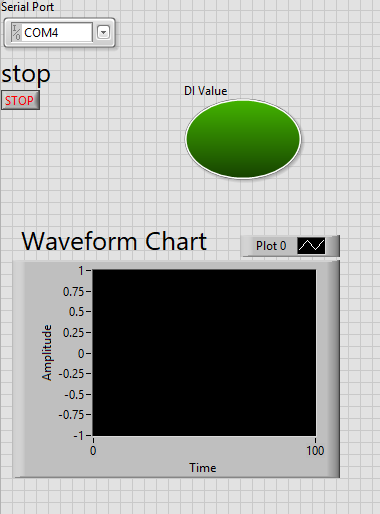
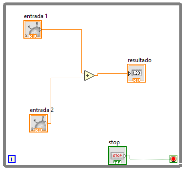
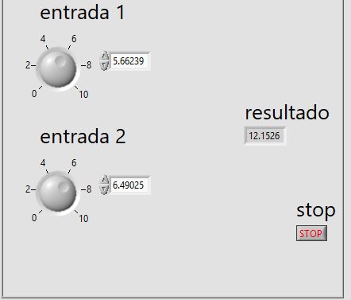

# Manual de Practicas 
## practica 1 
En esta práctica desarrollamos un programa en donde se tienen que sumar dos números, para esto tuvimos que poner un ciclo while para que el programa sea cíclico. Pusimos dos constantes con un rango de 0 a 10 y lo enlazamos a un bloque llamado ADD en donde su función es sumar y el resultado obtenido lo manda a un componente llamado indicador en el cual su función es mostrar el resultado de dicha suma
Esto se muestra a continuación 

La forma de conexión del sistema queda de esta manera donde podemos visualizar la forma en que se conecta cada componente

Posteriormente vemos el funcionamiento de dicho sistema 

## Práctic 2
En la práctica numero 3 realizar un programa donde calcula el Índice de Masa Corporal, para esto tuvimos que adquirir la fórmula para obtener el resultado (peso/altura^2). Tuvimos que poner 3 constantes para que el usuario pusiera sus datos, de este modo la conexión de los mismos será a la de la formula. Además, colocamos un termómetro como indicador para que nos señale si tenemos un peso normal, si tenemos sobrepeso o tenemos bajo peso. Esto se muestra a continuacin.
