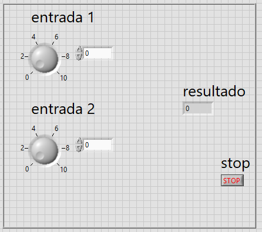
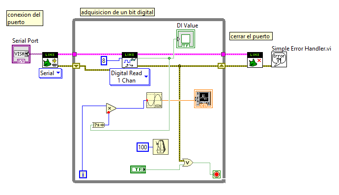
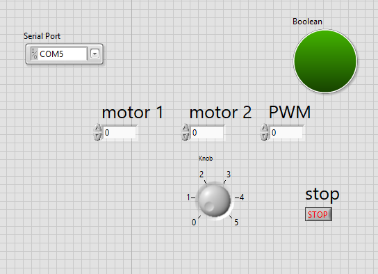

# Manual de Practicas 
## practica 1 
En esta práctica desarrollamos un programa en donde se tienen que sumar dos números, para esto tuvimos que poner un ciclo while para que el programa sea cíclico. Pusimos dos constantes con un rango de 0 a 10 y lo enlazamos a un bloque llamado ADD en donde su función es sumar y el resultado obtenido lo manda a un componente llamado indicador en el cual su función es mostrar el resultado de dicha suma
Esto se muestra a continuación 

La forma de conexión del sistema queda de esta manera donde podemos visualizar la forma en que se conecta cada componente:

Posteriormente vemos el funcionamiento de dicho sistema 

## Práctica 2
En la práctica numero 3 realizar un programa donde calcula el Índice de Masa Corporal, para esto tuvimos que adquirir la fórmula para obtener el resultado (peso/altura^2). Tuvimos que poner 3 constantes para que el usuario pusiera sus datos, de este modo la conexión de los mismos será a la de la formula. Además, colocamos un termómetro como indicador para que nos señale si tenemos un peso normal, si tenemos sobrepeso o tenemos bajo peso. Esto se muestra a continuación.

La conexión virtual del sistema es muy sencilla, esto se muestra a continuación:

Nuestro programa funcionando queda de la siguiente manera :

## Práctica 3
En esta práctica realizamos la conexión de un led en el cual parpadea cada medio segundo. 
La forma de conexión virtual queda de la siguiente manera, donde podemos observar que funciona mediante un ciclo  repetitivo y de esta manera jamas se detenga asta que el operador lo detenga:

Nuestro panel que ve el operador es de esta manera:

La forma en que funciona este sistema se muestra a continuación. Observe que solo se muestra el un led virtual y un botón de paro.

## Prática 4 
En esta práctica desarrollamos un sistema en donde se conecta un termómetro junto con un led, donde su principal función es que si se pasa del límite establecido el led prende, este límite se controla mediante un controlador en donde el usuario puede poner el límite que desee. Todo esto funciona mediante un ciclo repetitivo para que no se pare el programa a cada rato.

Como vemos en la imagen anterior aparece la conexión interna del programa en donde el usuario no podrá verlo, en la imagen que aparece a continuación se muestra lo que el usuario vera y podre manipular, que en este caso solo será el límite de temperatura para que prenda y apague el led.

La forma final del programa de esta manera:

## Práctica 5 
En la práctica 5 desarrollamos una interfaz con la placa de adquisición llamada arduino, la forma de conexión es diferente ya que se tiene que enlazar arduino con nuestro programa. La función de esta práctica es el prender un led y apagarse constantemente. La conexión virtual se desarrolla de esta manera:

Para la conexión de arduino tenemos que señalar el puerto en que está conectado, de esta manera se podrá realizar la interfaz, también se colocara la salida que se está manejando en arduino, en este caso es el pin 13. Esto se muestra a continuación:

Nuestra conexión con arduino queda de esta manera, también pudiendo observar que el led esta prendido y apagado.

## Práctica 6
Para desarrollar esta práctica necesitamos realizar la interfaz de arduino con lavbiew, de esta manera podremos trabajar adecuadamente. La función de esta práctica es que cuando se presione un interruptor conectada al arduino mande una señal para que esta mande un pulso y prenda un foco virtual y ala ves mande una señal senoidal y al volver a presionar el botón este pare.
Para esto realizamos una conexión en protoboard y en la salida manda un pulso en el pin 8 del arduino, con esto hace que prenda el foco y con esto manda la orden de marcar la onda senoidal. Esto se muestra a continuación:

La conexión del protoboard está de esta manera:

## Práctica 7 
En la práctica número 7 se realizó un sistema de prendido y apagado de un led con la diferencia que este tiene que parpadear al momento de presionar el botón. 
Se tuvo que conectar en la tablilla protoboard un foco led con un apagador. Una de las salidas del apagador va a la entrada 8 del arduino para que este mande la señal en lavbiew. La otra entrada que manda arduino es la del led, que va conectada en la entrada 4. La forma de conexión en lavbiew es de esta manera:

En el sistema de bloques que ve el usuario es de esta manera, note que solo se visualiza el foco virtual.

Y por último la conexión de la tablilla protoboard es de esta manera:

## Practica 8 
En esta práctica realizamos un proyecto con un sensor LM35, la forma de su conexión es diferente ya que el sensor manda señale analógicas y de esta manera es diferente. Como hemos visto en prácticas anteriores se realiza el interfaz con arduino para que su conexión sea aún más fácil. La forma de conexión en lavbiew es sencilla, ya que se conecta con un ciclo repetitivo para que este esté trabajando constantemente, a su vez, conectamos un termómetro para que este marque la temperatura en la que se encuentra la persona. Su forma de conexión se visualiza a continuación:

Por otra parte, el usuario solo vería un termómetro virtual y la entrada de arduino

Anteriormente solo se habló de la manera virtual, ahora hablaremos de la forma física, donde se conectó el sensor LM35, en donde la salida que manda el sensor se conectó a la entrada digital del arduino que fue la A0, esta entrada se pone en el programa de lavbiew como se mostró en la imagen anterior. Nuestro circuito queda de la siguiente manera:

##Práctica 9
En la práctica número 9 se realiza el control de un motor, este control determina el giro del motor, ya sea en giro anti horario u horario además que tiene un control de velocidad del motor. Para realizar esta práctica realizamos el enlace de arduino con lavbiew

La forma de conexión del circuito es algo fácil, primero tenemos que ingresar nuestro ciclo repetitivo. Después se colocarán los controles para manejar arduino, y por último se colocan los controladores y las entradas del motor en donde esto sirve para que podamos tener el control del motor. 

Como vemos en la imagen anterior se muestra la conexión interna del diagrama de bloques en donde el usuario no puede ver esta conexión. En la siguiente imagen se muestra la forma en que aparece en el programa ya funcionando, donde el usuario tendrá acceso a manejar la velocidad de motor, así como el giro del mismo y si desea conectar otro puerto lo puede hacer. 

A continuación, se muestra la forma de conexión del arduino donde es el medio de comunicación por donde se tendrá control de dicho motor.

Y por último se muestra el programa ya funcionando.

## Práctica 11
En esta práctica se realiza la conexión de un sensor análogo LM35, la principal función de este programa es que mande un aviso al usuario de es un problema de congelamiento, sobrecalentamiento o si esta en temperatura normal, este mensaje lo manda por medio de una comparación para así poder tener el mensaje, todo esto va conectado a un termómetro virtual donde marca la temperatura que manda el sensor LM35 en tiempo real. Esto se visualiza a continuación.

De forma que al mandar la temperatura el sensor de forma física esta la manda al termómetro para que este mande el mensaje si está en peligro o no el operador.

 Y todo este programa se ve de esta forma 
